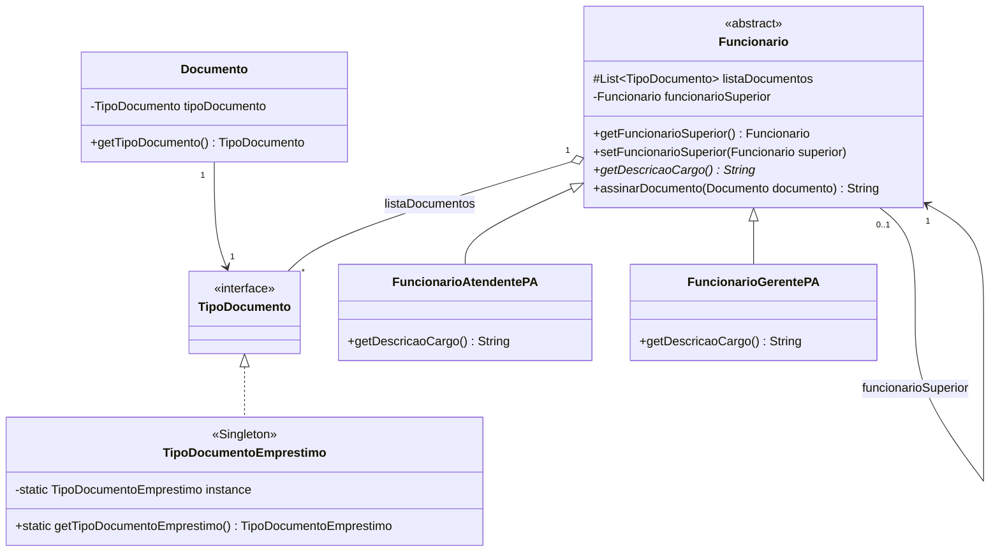

diagrama de classes:

```mermaid
classDiagram
    class TipoDocumento {
        <<interface>>
    }

    class TipoDocumentoEmprestimo {
        <<Singleton>>
        -static TipoDocumentoEmprestimo instance
        +static getTipoDocumentoEmprestimo() TipoDocumentoEmprestimo
    }

    TipoDocumento <|.. TipoDocumentoEmprestimo

    class Documento {
        -TipoDocumento tipoDocumento
        +getTipoDocumento() TipoDocumento
    }

    Documento "1" --> "1" TipoDocumento

    class Funcionario {
        <<abstract>>
        #List~TipoDocumento~ listaDocumentos
        -Funcionario funcionarioSuperior
        +getFuncionarioSuperior() Funcionario
        +setFuncionarioSuperior(Funcionario superior)
        +getDescricaoCargo()* String
        +assinarDocumento(Documento documento) String
    }

    class FuncionarioAtendentePA {
        +getDescricaoCargo() String
    }

    class FuncionarioGerentePA {
        +getDescricaoCargo() String
    }

    Funcionario <|-- FuncionarioAtendentePA
    Funcionario <|-- FuncionarioGerentePA

    Funcionario "0..1" --> "1" Funcionario : funcionarioSuperior
    Funcionario "1" o-- "*" TipoDocumento : listaDocumentos

```
